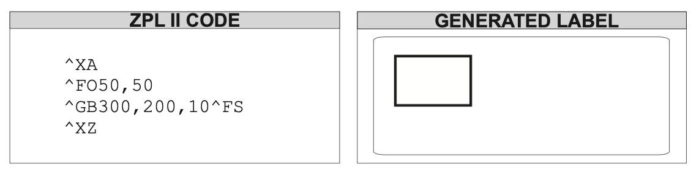
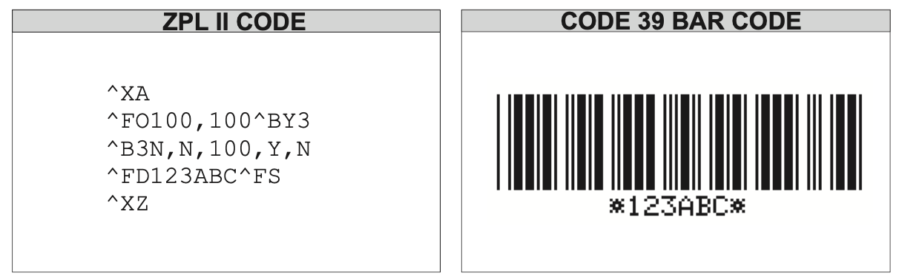

## ZPL 是什么

ZPL （ Zebra Programming Language ）是斑马公司（ Zebra Technologies ）的一个**页面描述语言（ page description language ）**，该语言主要用于打印标签。目前的版本是 **ZIP II**。

该语言主要由**命令（command）**和**控制符（ control character ）**组成的文本，

* 命令：语法形式为命令 + 参数，命令是以 caret(`^`) 开头，参数是一系列以逗号分割的字符，目前大约有170多种命令。比如可以通过 `^ADN,n,m` 命令控制字体的大小，其中 `n` 和 `m` 分别代表字体大小和子间距，`^ADN,18,10` 就代表最小可设置值， `^ADN,180,100` 代表最大可设置值。
* 控制符：以 tilde(`~`) 开头。

总是以 `^XA` 开头，以 `^XZ` 结尾，示例如下：

```zpl
^XA
^FO20,10
^ADN,90,50
^FDWikipedia^FS
^XZ
```

上述代码最终显示效果如下：


## 常用命令

* `^XA`：表示 ZPL 的开头
* `^XZ`：表示 ZPL 的结尾
* `^LH`：Label Home，用法：`^LHx,y`。用于设置标签的坐标原点，标签的坐标原点默认在左上角（0, 0），通过本标签设置其他命令位置的参考点。
* `^FO`： Field Origin，设置相对于 `^LH` 的 Filed 位置。用于控制标签的位置，用法 `^FOx,y,z`， 其中 x 表示x方向的点数，取值范围为 0-32000，默认值为0，y值表示y方向的点数。
* `^FT`:  Field Typeset，与 `^FO` 的意义相同？
* `^FD`：Field Data，表示要在 Field 中展示的数据。
* `^FS`: Field Separator，表示一个 Field 的结束，一个 Field 以 `^FO` 或 `^FT` 开头，以 `^FS` 结束。
* `^CI`:Change International Font/Encoding，用于非 ascii 字符的显示，比如 `^CI28` 就可以显示 utf-8 的中文字符。

## 方框和线

`^GB` 是用于生成方框或直线的命令，语法为：`^GBw,h,t,c,r`，各个参数及其意义如下表：

| 参数                        | 解释                                                         |
| --------------------------- | ------------------------------------------------------------ |
| w = box width (in dots)     | values: t 至 32000<br />defalut：t 或 1                      |
| h = box height              | values: t 至 32000<br />defalut：t 或 1                      |
| t = border thickness        | values: 1 to 32000<br />default: 1                           |
| c = line color              | values:<br />B = black<br />W = white<br />default: B        |
| r = degree of conerrounding | values: 0(no rounding) to 8 (heavies rounding)<br />defalut: 0 |

注意尺寸参数是以点来表示的，实际长度取决于打印机设置的分辨率。

示例：



## Code39

Code39 条形码是许多行业的标准，其中就包含美国国防部。生成该条形码的命令是 `^B3`，语法为： `^B3o,e,h,f,g`，各个参数及其意义如下：

| 参数                                     | 解释                                                         |
| ---------------------------------------- | ------------------------------------------------------------ |
| o = orientation                          | values:<br />N = normal<br />R = rotated 90 degrees<br />I = inverted 180 degrees<br />B = read from bottom up, 270 degrees<br />defult: current `^FW` value |
| e = mod - 43 check digit                 | values:<br />Y = yes<br />N = no<br />default: N             |
| h = bar code height(in dots)             | values: 1 to 32000<br />default: values set by `^BY`         |
| f = print interpretation line            | values:<br />Y = yes<br />N = no<br />defalut: Y             |
| g = print interpretation line above code | values:<br />Y = yes<br />N = no<br />defalut: N             |

示例：



## 二维码

生成二维码的命令为 `^BQ`，语法为：`^BQa,b,c,d,e`，各个参数的意义如下：

| 参数                     | 解释                                                         |
| ------------------------ | ------------------------------------------------------------ |
| a = field orientation    | values: N                                                    |
| b = model                | values: 1(original), 2(enhanced)<br />default: 2             |
| c = magnification factor | vaules: 1 - 10<br />default:<br />1 on 150 dpi printers<br />2 on 200 dpi printers<br />... |
| d = error correction     | values:<br />H = ultra -high reliability level<br />Q = high reliability level<br />M = standard level<br />L = high density level<br />default:<br />Q = if empty<br />M = invalid values |
| e = mask value           | values: 0 - 7<br />defalue: 7                                |

二维码所表示的数据是紧邻 `^BQ` 命令之后的第一个 `^FD` 命令中的文本内容。此时 `^FD` 命令有4个开关参数，其中两个是必选，一个是可选，另一个是根据一个选项的取值决定。这4个开关分别是：

* 混合模式：`<D>,`， optional
* 纠错级别： `<H, Q, M, L>` mandatory
* 数据输入： `<A, M>,`, mandatory
* 字符模式 `<N, A, Bdddd, K>`，如果数据输入模式为`M`,则必选，否则为可选。

示例：

```zpl
^XA
^FO100,100 
^BQN,2,10 
^FDMM,AZPL II BQ command^FS 
^XZ
```


参考资料：

* [ZPL-wikipedia](https://en.wikipedia.org/wiki/Zebra_Programming_Language)

* [Labelary-实时显示 ZPL 结果](http://labelary.com/viewer.html)

* [ZPL II Programming Guide](https://www.zebra.com/content/dam/zebra/manuals/printers/common/programming/zpl-zbi2-pm-en.pdf)

* [Library used to generated commons ZPL command to print label on Zebra printer with java](https://github.com/w3blogfr/zebra-zpl)


